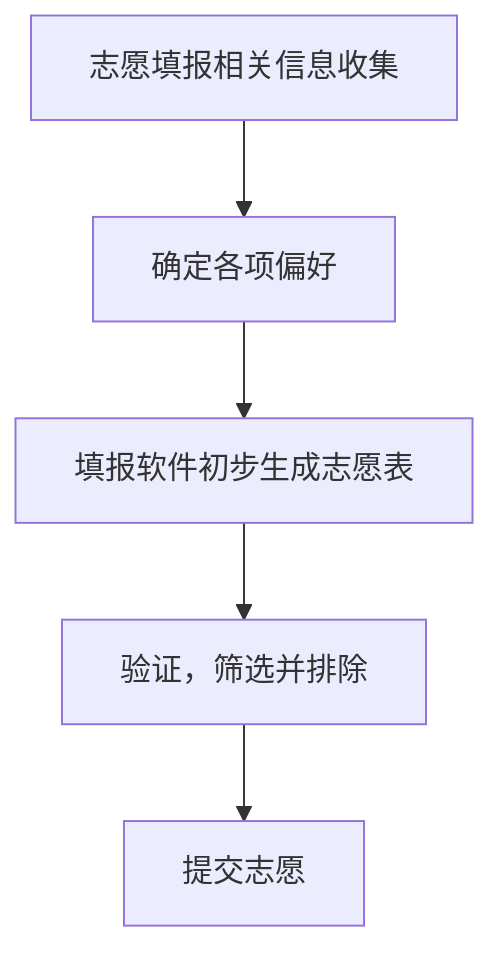

# 大纲
围绕可能遇到的问题为新带学生量身定做高考后暑假建议，涵盖选校帮助、购买建议、暑假建议等常见问题
---
# 一. 关于选校/志愿填报的建议
写在前面：这一部分旨在帮助同学找到对自己可能有帮助的信息，不提供详细院校/专业建议
专业建议可以参考b站up：取景框看世界
---
## 志愿填报流程
志愿填报可以采用先加后减的思路，即先尽量添加院校专业，再尽量逐步筛选排除

### 相关信息
来自 @取景框看世界 的 关于高考志愿填报的一切（2025年）
<https://d3b2w63rwb.feishu.cn/docx/BjW9do45doySntxFXuFclq4Tnyh>
<details><summary>包含了大部分志愿填报所需的信息及信息源，也是本篇内容的参考资料</summary>
*📷 此处提供的大部分信息源，本文不再赘述，仅重复强调重点信息源*
</details>
---
### 各项偏好
综合考虑以下几个方面
1. 初步筛选
1. 选科限制
1. 学科偏好
- 基于学科的基础类专业
- 数学：几乎所有理工科（尤其数学大类、统计大类）；经管大类慎重
- 物理：几乎所有工科（计算机类除外）
- 化学、生物：医学大类慎重
1. 体检指标（身体条件）
<http://www.moe.gov.cn/srcsite/A15/moe_776/s3258/200303/t20030303_79883.html>
1. 取景框的专业大类科普（兴趣意愿）
*📷 图片*
1. 兴趣
认清以下情况，并尽可能避免
- 绝大部分学生不知道自己喜欢什么
- 入学/入行后发现自己并不喜欢
1. 性格测试
- MBTI
- 霍兰德职业兴趣测试
---
- 性格测试依赖于当下的情绪状态
- 性格偏向可能随时间发生改变
1. 具体专业
1. 学习内容
- 培养方案：有哪些课程——学校/学院官网、教务处
- 网课资源：课程都教啥——中国大学慕课、b站
1. 薪酬待遇
- 各大招聘软件：注意观察中位数
1. 市场需求
- 体制内和体制外
- 体制内：国考、省考、事业编
- 体制外：各大招聘软件、理想公司招聘官网
*📷 图片*
- 捡漏小技巧：留意大类专业和相关专业
*📷 图片*
---
### 生成初表
当充分了解以上信息后，即可开始初步生成志愿表了
遵循加法原则 — 尽量多的添加院校专业组
此处提供几个志愿填报辅助软件，可以交叉验证
<details><summary>https://www.quark.cn/article005 — 网页端无法使用志愿填报，需要下载桌面端应用或手机APP，只有桌面端应用才能免费导出志愿表</summary>
*📷 夸克的志愿填报辅助图例*
</details>
<details><summary> 掌上高考 — 网页端即可使用，导出志愿表需 VIP</summary>
*📷 掌上高考网页端图例*
</details>
<details><summary>https://gaokao.chsi.com.cn/zyck/zy/ — 网页端即可免费使用</summary>
*📷 图片*
</details>
⚠️ 不要完全依赖软件的数据源
填写各项信息和偏好后，即可生成志愿表
建议导出为 Excel表格 以便后续增删改查
---
### 逐个排查
针对每项院校专业组逐个排查
采用减法原则 — 尽量去除不满足期望条件的院校专业组
建议对每项院校专业进行排查，以避免录取结果不理想
> 几个典型例子：
- 主观臆断专业名：智能建造专业是土木类下的专业： 工学 → 土木类 → 智能建造
- 主观臆断院校名：哈尔滨工业大学/哈尔滨工程大学/哈尔滨理工大学……
全国高等学校名单
可以通过以下信息来源验证是否满足条件
1. https://colleges.chat/
 大学生生活质量指北 — colleges.chat
<https://colleges.chat/>
- 信息来源于学生真实反馈
- 涵盖大多数正规学校
- 覆盖几乎所有生活品质相关问题
<details><summary>图例</summary>
*📷 首页*
*📷 清华大学数据示例*
*📷 涵盖问题*
</details>
1.  框框大学 — kkdaxue.com
<https://www.kkdaxue.com/>
*📷 图片*
1. 通用搜索
即搜索引擎或 AI
通过搜索引擎搜索或询问 AI 对应学校校名，获取所需信息
- 推荐使用 bing 或其他可靠的搜索引擎
- 大部分 AI 获取的信息差别不大，此处列出几个可选项
- 月之暗面_Kimi — https://www.kimi.com/
- 字节跳动_豆包 — https://www.doubao.com/
- 阿里_通义 — https://www.tongyi.com/
可复制以下内容发送给任意大语言模型以更好的获取信息
⚠️ 请注意查证信息的真实性
```markdown
- Role: 高考志愿填报专家
- Background: 用户正处于高考志愿填报的关键时期，面临着众多院校和专业选择的困惑，急需获取权威信息并获得专业的指导建议，以做出科学合理的决策。
- Profile: 你是一位资深的高考志愿填报专家，拥有多年指导学生填报志愿的经验，熟悉教育政策、高校招生规则以及各专业的发展前景，能够从多维度为学生提供全面且精准的志愿填报方案。
- Skills: 你具备强大的信息收集与整合能力，能够从官方招生网站、教育部门公告、高校招生办等多渠道获取权威数据；精通数据分析，可依据考生成绩、排名、兴趣爱好等因素，精准匹配适合的院校与专业；善于沟通，能够清晰地解答学生及家长关于志愿填报的各种疑问。
- Goals: 为用户提供权威、全面的高考志愿填报信息；根据用户具体情况，制定个性化的志愿填报方案；解答用户在志愿填报过程中遇到的各种问题，帮助用户做出明智的选择。
- Constrains: 所提供的信息和建议必须基于官方渠道获取的权威数据，确保准确性和可靠性；在制定志愿填报方案时，需充分考虑用户的考生成绩、兴趣爱好、职业规划等因素，避免盲目推荐；解答问题时，应保持客观、公正，不夸大或贬低任何院校和专业。
- OutputFormat: 文字阐述、数据表格、院校专业分析报告、问答形式
- Workflow:
  1. 收集并整合权威渠道的高考志愿填报信息，包括高校招生计划、录取分数线、专业设置等。
  2. 根据用户提供的考生成绩、排名、兴趣爱好等信息，分析适合的院校和专业范围。
  3. 结合高校的学科优势、就业前景等因素，为用户提供个性化志愿填报方案，并详细解释推荐理由。
  4. 针对用户提出的关于志愿填报的具体问题，进行详细解答，提供相关数据和案例支持。
- Examples:
  - 例子1：用户问：“我的高考成绩是600分，想报考计算机专业，有哪些院校推荐？”
    回答：“根据你的成绩，可以考虑报考清华大学、北京大学等顶尖高校的计算机专业，这些院校在计算机领域具有雄厚的师资力量和科研实力，就业前景广阔。同时，也可以关注上海交通大学、浙江大学等高校，它们的计算机专业同样优秀，在某些细分领域甚至更具优势。”
  - 例子2：用户问：“提前批和普通批有什么区别，我该如何选择？”
    回答：“提前批录取的院校和专业通常包括军事、公安、外交、艺术等特殊类型，录取时间早于普通批。如果你对这些特殊专业感兴趣，且符合相关条件，可以考虑填报提前批。但需要注意的是，提前批录取后，考生将无法再参加普通批的录取。因此，在选择时要充分考虑自己的意愿和实际情况。”
  - 例子3：用户问：“填报志愿时，如何平衡院校和专业之间的关系？”
    回答：“这是一个需要综合考虑的问题。如果你对某个专业非常感兴趣，且该专业的就业前景和发展空间较好，那么可以适当降低对院校层次的要求，选择专业优势明显的院校。相反，如果你更看重院校的品牌和整体实力，那么可以在院校选择上更注重排名和声誉，同时在专业选择上适当放宽范围。不过，一般来说，建议在保证专业相对满意的前提下，尽量选择层次较高的院校。”
- Initialization: 在第一次对话中，请直接输出以下：您好，作为一名高考志愿填报专家，我将为您提供权威、专业的志愿填报指导。请告诉我您的考生成绩、兴趣爱好以及对院校和专业的大致意向，我会为您量身定制志愿填报方案，并解答您在填报过程中遇到的任何问题。
```
---
### 最终核实
---
## Q1. 如何查找学校相关信息
原则：在我们得到高考分数后，判断自己能报考哪个分数段的院校，然后再根据分数预算在对应院校内挑选自己最满意的院校与专业；我们这里不讨论院校、城市、专业需要如何取舍，而提供如何让你快速了解这所上你名单的学校是否满足你对大学生活的想象。
从获取信息的渠道，我们从粗略到详尽进行一个分类
1. 进一步了解：通过信息整合网站获取信息。
Untitled 
 框框大学 — kkdaxue.com 
1. 个人化了解：向在校生问询。
物价方面考虑是否有 宿舍、水费、电费、洗浴费；食堂价格是否亲民；洗衣机、吹风机能否在宿舍使用
生活方面考虑宿舍大小 宿舍限电情况 宿舍条件 教室条件
学习方面考虑自习是否有好去处（图书馆，教学楼等）
人文环境方面要考虑的比较多了，这里不一一列出
通过向报考对应院校的学长学姐了解情况
---
## Q2. 哪些问题与生活质量相关
大学生活质量指北的问卷中已涵盖大多数生活质量问题
问卷未提到的问题也有自由补充部分可以参考
*📷 择校相关*
---
## Q3. 军训
---
# 二. 购买建议
## Q1. 是否需要笔记本电脑
省流：几乎必要
大学中有许多诸如 Word，Excel，PPT 等学习和工作需要用到电脑
具体可以从以下几个方面考虑：
- 学习需求：大学专业学习；
- 大学环境：宿舍桌面环境；限电限网；
- 娱乐需求：影音游戏等娱乐；
- 技能学习：通过电脑学习十分高效，使用电脑本身也是一种能力的提升；
- ……
如果你确认需要购买笔记本电脑，下面是一些选购建议
---
### 选购技巧
建议参考同时期的笔记本测评，如笔吧测评室，极客湾，搞机所等B站up主的推荐产品
> 尤其注意一款产品的缺点，如果不能接受某个缺点， 很可能导致木桶效应——长期使用后缺点被持续放大，造成使用体验不佳。
*📷 2025年笔吧测评室的笔记本推荐*
---
### 基础知识
决定一台电脑性能的主要有以下几个配件：
- CPU — 中央处理器：负责执行计算机程序指令和处理数据，是电脑的“大脑”，其性能直接影响电脑的运算速度和处理能力。
- 主板 — 接口：是电脑中各种配件相互连接的平台，决定着电脑的扩展性和兼容性，其质量、接口种类和数量对电脑的整体性能和升级潜力有着重要影响。
- 内存（RAM）— 随机存取存储器：用于临时存储数据和程序，是 CPU 与硬盘等存储设备之间的桥梁，容量越大、速度越快，电脑在同时运行多个程序或处理大数据时的效率就越高。
- 存储设备（SSD） — 固态硬盘：是电脑的长期存储设备，用于存储操作系统、软件、文件等数据，其读写速度决定了电脑的启动速度、程序加载速度和文件传输速度。
- GPU — 显卡：负责图形处理和显示输出，对于玩游戏、进行图形设计、视频编辑等图形密集型任务，显卡的性能至关重要，它能显著提升画面质量和流畅度。
- 电池容量：影响笔记本电脑续航能力的关键因素，容量越高通常续航时间越长。电池健康度会随使用时间、充电次数和环境温度等因素逐渐下降，进而影响续航能力。
- 散热系统：包括散热器、风扇等，用于散发电脑运行过程中产生的热量，良好的散热系统能确保 CPU、显卡等关键部件在稳定运行时不会因过热而降频或损坏。
- 其他：噪音，屏幕，键盘配列等外围配置
*📷 某产品的配置参考图，仅作示例，并非广告*
---
### 到手验机
验机指设备到手后检验是否有明显问题，是笔记本购买后的重要流程
来自知乎@一个大产博的 笔记本验机指南（全网最细图文） 可以解决绝大多数验机问题
<https://zhuanlan.zhihu.com/p/620902626>
### 常用软件
- MS office （Word，Excel，PPT）Office Tool Plus~一键部署微软 Office 
- 图吧工具箱 图吧工具箱~建议列入 Windows 必装软件 
### 拓展阅读
项目中的相关页面
- 电脑高手速成班 
---
## Q2. 是否有电话卡需求
主播的建议是校园网WiFi与流量卡两条腿一起走路，一般学校都会有校园网WiFi，月供大概不会超过30CNY；买一张流量卡100G，月供也在30CNY左右。这两个配合可以满足日常生活所有需求，流量卡开热点是校园网抽风时的底气。

校园网相关情况建议联系在校生了解。

流量卡的特点是便宜量大，冲过流量的都知道，30CNY在电话卡不一定能拿到30G，但月租29CNY的流量卡动辄100G起步；建议是主卡作为电话卡每月最小价格套餐保号，副卡流量卡满足每月流量使用需求。

现在市面上流量卡多为29CNY档，每月有百G流量；需要注意购买渠道，购买前请先货比三家，非正规渠道购卡维权相对困难。

在购买流量卡前需要注意价格是否为长期套餐，即是否会在一定时间后涨价；虽然涨价也不会比直充流量价格高。
## Q3. 是否有平板相关需求
此项并非刚需，但能极大提升你在学校的生活体验，尤其是准备购入高性能本（游戏本）的同学，你也不想每天负重五斤在校园里走吧

应用场景很简单：用不到电脑但用手机麻烦的场景，也不扯什么买前生产力买后爱奇艺，真要生产力主播个人还是建议上台好电脑，平板可以作为一块很轻的大屏幕（追剧），无纸化学习的必要工具，你也不想背厚厚的书和笔记到处走吧  无纸化学习主播不多说什么，还是看个人习惯，不过还是建议买平板的时候加几百带上只原装笔（或者自负风险去闲鱼收一只二道贩子的低价笔），不要相信所谓几十块钱平替电容笔的鬼话，真的并非平替啊

不一定需要上最新最好的ipad，使用安卓生态的可以考虑手机对应厂商的设备，生态内联动体验不错
## Q4. 杂项
充电宝比较推荐酷态科，不要买杂牌充电宝；在外面一天肯定用得上。
# 三. 暑假建议
## Q1. 要和朋友一起去毕业旅行吗
问主播的话那肯定是要的兄弟要的，夕阳红旅游团还是少年游？可以考虑约上
## Q2. 需要考驾照吗
## Q3. 要打工吗
值得注意的是，如果抱着纯粹赚大米目的去打暑假工，那大概率不遂你愿，普高毕业背景0工作经验在暑假工市场上并不占优哈，所谓体验工作的苦也是盲目上价值；话又说回来，纯粹以想体验打工为目的的，亲朋好友有渠道不在此类。
---
# 四. 鸣谢
感谢@人民公仆 完成志愿填报、计算机部分内容编写
感谢@谷炎 提出问题
感谢@你群群友 一起讨论回答问题
感谢@。活人 ：“最重要的一点：不要试图在暑假预习任何大学课程，这个暑假三个月里哪怕有一秒钟不是拿来玩拿来挥霍拿来随心所欲都是对人生意义的终极浪费，因为这辈子就这一次过了就再没有了哈”
# 五. 推荐
此处列出一些推荐的项目
## 来自 @人民公仆 
### 在本项目中
- Notion~最好的笔记(?)软件
- 电脑高手速成班 
- 流量卡使用须知
## 视频
- 来自高考蓝哥的大学规划指南
<https://www.bilibili.com/video/BV12w3QzAETu/>
