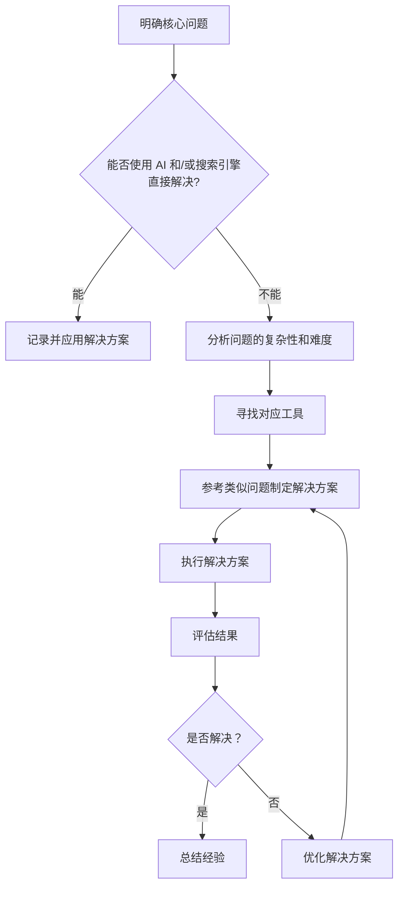

## 介绍
本文介绍如何快速成为通俗意义上的电脑高手
---
## 目录
---
# 习惯
作为电脑高手，有些习惯是十分有益的
此处列出部分值得参考的习惯
- 多探索，有耐心
具有自主探索的精神能让人更积极的学习，自己探索出的答案会带来正反馈
大多数计算机问题都能在互联网上找到解决方案
只要肯花时间，几乎没什么解决不了的问题
- 先看设置
对于任何软件，设置相当于开发者提供的可选参数
不同的配置对于软件功能可能有极大的影响
- 积极提问
不用惧怕在社区提问，大多数社区的成员都是友善的
大部分情况下，他们乐于倾听新手提出的问题
但也要注意，不要总是被一些蠢问题绊住
<details><summary>推荐阅读：提问的艺术（简体中文）</summary>
<https://github.com/ryanhanwu/How-To-Ask-Questions-The-Smart-Way/blob/main/README-zh_CN.md>
*📷 经典的蠢问题*
</details>
- 
---
## 解决问题
明确问题并寻找解决方案的能力是解决任何问题的关键
建立自己的通用解决方案，当遇到任何问题时，首先按这样的方案思考
以下是一种示例

---
## AI
目前 AI 已经能够解决很多繁琐的问题，曾经一些看似简单但对于初学者仍需要查阅各种资料才能解决的问题，只需要问一句话就能让 LLM（大语言模型） 给出靠谱的解决方案
以下列出几个推荐使用的 AI 产品及一些相关的技巧
排名不分先后，仅供参考
- https://www.kimi.com/
- https://www.tongyi.com/
- https://www.doubao.com/
---
## 搜索引擎
目前 AI 获取信息的能力已经足以替代搜索引擎，不过搜索引擎仍然具有一定的存在意义
掌握基本的搜索技巧也有助于高效获取可靠信息
拓展阅读 浏览器是什么 
---
# 硬件
## 装机
作为电脑高手，掌握基础的装机知识是很有必要的。
你需要了解以下内容的相关知识
- 从零开始的装机教程 
- 操作系统安装 
---
# 软件
## 系统配置
一个优秀的电脑高手有自己独特的系统
电脑高手通常会在使用自己的设备时得心应手，心情愉悦
而在使用其他不符合自己使用习惯的设备时面露难色，操作变形
---
### 软件包管理器
作为初学者，安装软件需要去浏览器搜索软件官网，然后下载软件安装程序。
这也是大多数 Windows 软件的正规安装方法。
而作为电脑高手，安装软件应该优先使用命令行而不是去浏览器下载，更不应该找各种应用商店。
在各个操作系统上都有丰富的软件包管理器生态，例如 Windows 上有 Winget，Scoop，Chocolatey等。
> 如果你追求最好的软件包管理器，可以尝试 https://www.archlinuxcn.org/
虽然 CLI（命令行交互界面）很有极客风格，但盛行于普通用户的 GUI（图形用户界面）也并非不被电脑高手所接受
UniGetUI 是一款可以高效管理多个软件包管理器的软件，它也可以通过 winget 等软件包管理器安装
```powershell
winget install --id=MartiCliment.UniGetUI  -e
```
---
### 系统美化
在此仅列举对美化效果提升巨大的核心组件，更多信息可以参阅本项目中的：Windows桌面环境美化
- https://www.wallpaperengine.io/：在 Windows 桌面上使用精美绝伦的动态壁纸。
- ：该项目旨在增强 Windows 上的工作环境。
- https://windhawk.net/：Windows 和程序的定制市场
- …
---
### 系统交互
电脑高手与自己心爱的设备交互必须满足：高效，舒适，优雅
- 鼠标手势：用过就回不去的交互方式，有许多实现方式，此处仅举一例
<https://www.yingdev.com/projects/wgestures>
- 程序启动器：合格的电脑高手不会满桌面找应用程序图标，而是按下 Alt + Space 然后键盘输入几个字符后回车，有许多实现方式，此处仅举一例
<https://github.com/Flow-Launcher/Flow.Launcher>
- 更多实用程序：
---
# 技术
作为电脑高手，有一些基本技术和知识需要掌握
别担心，不需要死记硬背，因为这些知识都是经常接触到的“高频考点”，经常遇到自然就能掌握
---
## 命令行
不论是 Windows 还是 Linux，命令行都是电脑高手的必修课
掌握一些基础命令的用法，在遇到相应场景时能及时处理
---
## 版本控制
说到版本控制，毫无疑问就是 Git
掌握基本的 Git 用法也是电脑高手的必修课
---
## 网络基础
无论哪个领域的电脑高手，都应该了解基本的网络知识
### 一、网络架构与分层模型
1. OSI七层模型
- 物理层：传输比特流（如电缆、光纤）。
- 数据链路层：封装成帧，解决物理介质访问问题（如MAC地址）。
- 网络层：IP地址寻址与路由（如IP协议）。
- 传输层：端到端通信（如TCP/UDP）。
- 会话层：管理会话连接（如NetBIOS）。
- 表示层：数据格式转换（如加密、压缩）。
- 应用层：用户接口（如HTTP、FTP）。
1. TCP/IP四层模型
- 网络接口层：物理和数据链路层功能。
- 网际层：IP协议（如IPv4/IPv6）。
- 传输层：TCP/UDP。
- 应用层：整合OSI的会话层、表示层和应用层功能（如HTTP、SMTP）。
示例：
- HTTP协议运行在TCP/IP模型的应用层，对应OSI模型的应用层+表示层+会话层。
---
### 二、网络拓扑结构
1. 常见类型
- 星型拓扑：以交换机为中心，单点故障影响小（如企业办公网）。
- 总线型拓扑：共享介质（如早期以太网），因碰撞域问题逐渐淘汰。
- 网状拓扑：冗余链路提升可靠性（如数据中心全连接结构）。
- 混合拓扑：组合多种结构（如“核心层环网+接入层星型”）。
1. 物理 vs 逻辑拓扑
- 物理拓扑：设备实际连接方式（如交换机与终端的物理连线）。
- 逻辑拓扑：数据传输路径（如以太网逻辑上为总线型，但物理上为星型）。
案例：
- 某企业采用千兆星型拓扑连接200台终端，单点故障仅影响单个端口，维护成本降低。
---
### 三、IP地址与子网掩码
1. IP地址
- IPv4：32位地址（如192.168.1.1），分为A/B/C类及CIDR（无类别域间路由）。
- IPv6：128位地址（如2001:0db8::1），解决IPv4地址耗尽问题。
1. 子网掩码
- 用于划分网络地址和主机地址（如255.255.255.0）。
- 网络地址：主机号全为0（如125.0.0.0）。
- 广播地址：主机号全为255（如125.255.255.255）。
关键点：
- NAT（网络地址转换）：将私有IP（如192.168.x.x）转换为公网IP，节省地址资源。
---
### 四、网络设备
1. 路由器（Router）
- 连接不同网络，基于IP地址进行路由选择（如OSPF、BGP协议）。
1. 交换机（Switch）
- 基于MAC地址转发数据帧，支持VLAN划分（如企业内网隔离）。
1. 防火墙（Firewall）
- 包过滤：基于IP/端口规则过滤流量。
- 状态检测：跟踪连接状态（如防御SYN Flood攻击）。
- 下一代防火墙（NGFW）：集成IPS、应用识别等功能（如拦截HTTPS中的恶意文件）。
1. 其他设备
- 网卡（NIC）：计算机连接网络的硬件。
- 无线AP（Access Point）：提供无线网络接入（如Wi-Fi热点）。
---
### 五、数据传输与路由机制
1. 数据封装与解封装
- 封装过程：
应用层（数据）→传输层（段/Segment）→网络层（包/Packet）→数据链路层（帧/Frame）→物理层（比特流）。
- 解封装：逐层剥离头部信息。
示例：
- 视频会议系统使用UDP协议封装RTP流，减少握手过程，将时延控制在150ms以内。
1. 路由协议
- 静态路由：手动配置（适用于小型网络）。
- 动态路由：
- RIP：基于跳数（最大15跳）。
- OSPF：基于链路状态计算最短路径。
- BGP：自治系统间路由（如互联网骨干网）。
---
### 六、网络安全基础
1. 常见威胁
- 恶意软件：病毒、蠕虫、勒索软件（如WannaCry）。
- 拒绝服务攻击（DoS/DDoS）：消耗服务器资源（如僵尸网络发起攻击）。
- 零日漏洞：未公开的软件漏洞（如Log4j漏洞）。
1. 防护技术
- 加密技术：
- 对称加密：AES-256（如保护电力SCADA系统）。
- 非对称加密：RSA（如HTTPS握手）。
- 哈希算法：SHA-256（如区块链交易验证）。
- 访问控制：
- 身份验证：用户名/密码、双因素认证（2FA）。
- 权限管理：最小权限原则（如限制RDP端口仅对特定IP开放）。
- 入侵检测与防御：
- IDS：监测异常行为（如Snort检测SQL注入）。
- IPS：主动阻断攻击（如防御APT攻击）。
1. 法律与规范
- 《中华人民共和国网络安全法》：明确网络运营者的责任，要求防范攻击、保护数据安全。
---
### 七、常见网络协议与工具
1. 应用层协议
- HTTP/HTTPS：网页浏览（HTTPS通过TLS加密保障安全）。
- FTP：文件传输。
- SMTP/POP/IMAP：电子邮件收发。
1. 传输层协议
- TCP：可靠传输（三次握手、滑动窗口）。
- UDP：无连接、低延迟（如实时音视频）。
1. 网络层协议
- ICMP：网络诊断（如ping命令）。
1. 域名系统（DNS）
- 将域名解析为IP地址（如www.baidu.com → 180.101.49.12）。
1. 动态主机配置协议（DHCP）
- 自动分配IP地址（如家庭路由器自动分配局域网地址）。
---
## 一些零碎的知识点
---
## BT下载
BT下载是基于P2P（点对点）技术的文件共享方式。用户通过种子文件（.torrent）获取文件信息和Tracker服务器地址，由Tracker协调多个Peer（节点）直接交换数据块，无需依赖中心服务器。下载时同步上传已获取的片段（即做种），实现高效分发。
- 磁力链接：替代种子文件
- 分片校验：保证文件完整性
- 上传/下载速度：与参与人数相关
---
## RSS
一种基于 XML 的标准化信息聚合协议，用户通过订阅网站的提要（Feed）自动获取更新内容。阅读器定期从提要地址抓取 XML 数据，解析并展示标题、摘要及链接，无需手动访问网站。
提要（Feed）：网站内容的更新摘要（如 https://example.com/feed.xml）
阅读器（Aggregator）：解析和展示RSS内容的工具
Atom：与RSS类似的替代协议，功能更灵活
> Folo 是一款RSS信息聚合平台，在本项目中： Folo~次世代信息源聚合站 
---
# 社区
作为电脑高手，经常逛技术论坛和社区以掌握最新资讯是必要的。
以下是各个领域的知名社区，请简单了解，至少掌握每个社区的功能定位。
## 圈层
电脑/计算机的广度和深度导致了不同社区的讨论范畴可能天差地别
以下列出一些相关的社区圈层
---
# 作业
实际上这份作业并不是一时半会能完成的
期望这份作业能长久的伴随你的生活
1. 找机会为一台设备安装/重装 Windows 或任何操作系统
1. 为这台系统配置趁手的工作环境
1. 不断优化自己的设备和系统，以及自己
